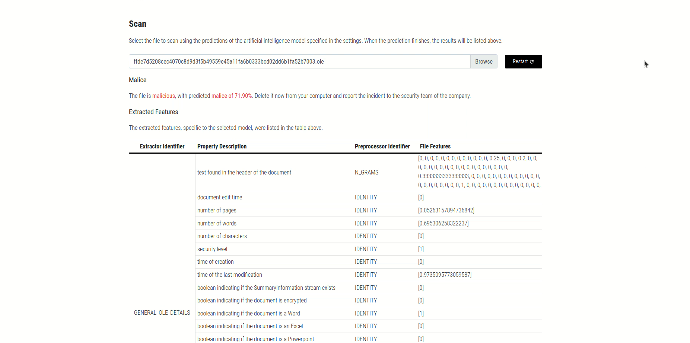
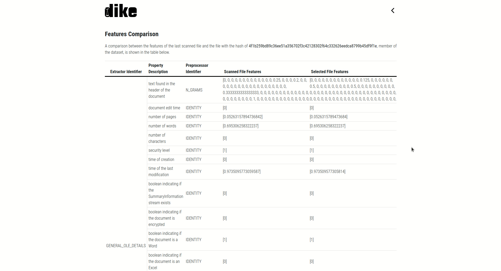
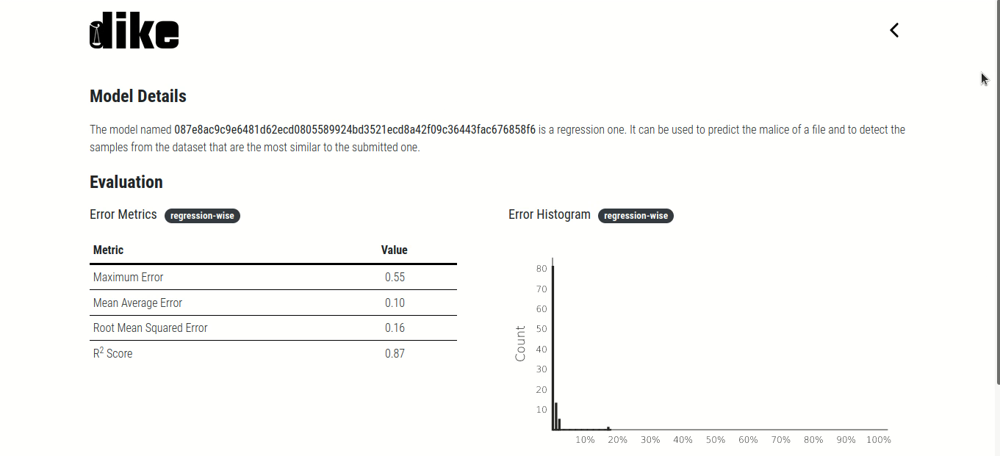
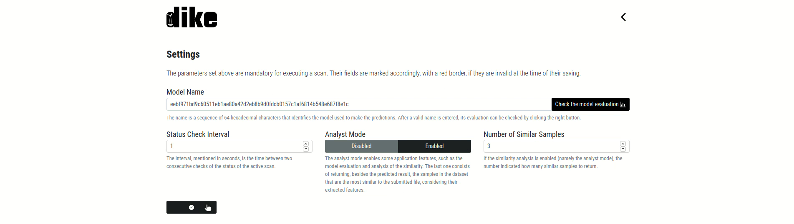

    

    <b><i>Platform for Automatic Analysis of Malicious Applications Using Artificial Intelligence Algorithms</i></b>

 

---

- [Description 🖼️](#description-️)
  - [Objectives 🎯](#objectives-)
  - [Features 🧰](#features-)
- [Important Observation ⚠️](#important-observation-️)
- [Setup 🛠️](#setup-️)
  - [For Private Repositories 🙊](#for-private-repositories-)
- [Typical Usage 🔎](#typical-usage-)
  - [For Clients 👨‍💼](#for-clients-)
  - [For Administrators 👩‍💻](#for-administrators-)
  - [For Other Systems 🖥️](#for-other-systems-️)
- [Resources 🥣](#resources-)

---

# Description 🖼️

***dike*** ( pronounced */ˈdaɪkiː/*) is an open-source platform combining the fields of **malware analysis** with the one of **artificial intelligence**, more precisely the machine learning subfield.

## Objectives 🎯

At the moment, ***dike*** is capable only of analyzing **Portable Executable** and **Object Linking and Embedding** formats. Besides this limitation, it has three main objectives:
1. **Regression of malice**
2. **Classification in malware families**
3. **Similarity analysis**.

## Features 🧰

The software enables the creation of **analysis pipelines** (named in the context of the platform *models*), which deals with the specific steps of the malware analysis and data engineering:
1. **Dataset management**, where it uses three main sources of labeled PE and OLE files:
    - The open-source dataset [DikeDataset](https://github.com/iosifache/DikeDataset)
    - Accurate results of analysis made by the analysts of the organization in which the platform is set up
    - Results of automatic VirusTotal scans
2. **Features extraction**, in which extractors are used to obtain relevant information such as:
    - Strings
    - Characteristics of the file format
    - Opcodes
    - Windows API calls
    - Macros
3. **Features preprocessing**, where preprocessors are used to transform the features into a more friendly format for the machine learning algorithms
    - Transformations
        - Binarization
        - Discretization
        - Counting (and in a special approach, for categories of opcodes and API calls)
        - Vectorization
        - NGrams
    - Scaling
    - Dimensionality reduction
4. **Training of machine learning models** with included cross-validation and evaluation (regression-wise and classification-wise).

# Important Observation ⚠️

***dike*** is part of my Bachelor thesis, which aims at demonstrating that the artificial intelligence techniques can improve the malware analysis. The document and the presentation (in Romanian 🇷🇴 only) can be found in a separate repository that will be made public in the near future.

At the moment, this is the only place where some relevant information can be found:
- Software requirements
- Architecture (more detailed than the description above)
- Testing
- Evaluation
- Further development. 

# Setup 🛠️

1. Download the script [`manage.sh`](https://github.com/iosifache/dike/blob/main/infrastructure/manage.sh) from the folder `infrastructure`.
2. Obtain a VirusTotal API key.
3. Create and host (on a server which the platform can access) a TGZ archive containing two folders, `ghidra` (with a Ghidra project) and `qiling` (with the dynamically linked libraries needed by Qiling).
4. Run the script and follow the instructions.

    
Setup Example

    

## For Private Repositories 🙊

If the repository hosting the platform is private, there are two steps that needs to be performed before:
1. Generate an asymmetric key pair via `ssh-keygen -t ed25519 -C "EMAIL_ADDRESS"`, where `EMAIL_ADDRESS` need to be populated with your email address.
2. Add the public one into the GitHub's deployment key section.

# Typical Usage 🔎

## For Clients 👨‍💼

    
Malice Prediction

    <kbd>
        
    </kbd>

    
Similarity Analysis

    <kbd>
        
    </kbd>

    
Feature-wise Comparison of Samples

    <kbd>
        
    </kbd>

    
Model Evaluation

    <kbd>
        
    </kbd>

    
Settings

    <kbd>
        
    </kbd>

## For Administrators 👩‍💻

A powerful command line interface can be used by the administrators, by running the `dike` command on a leader server. Some available commands are demonstrated in the recording below.

    
Connections with Subordinate Servers

    

    
Datasets

    

    
Training and Management of Models

    

    
Predictions with Models

    

The administrators use also manual editing of YAML files, respecting a schema depending on the context in which the file is used. Some existing files (one per type, only for exampling purposes) has comments to document these schemas as follows:
- [Platform configuration](data/configuration/configuration.yaml)
- [Dataset creation](others/configuration_files/datasets/small_pe.yaml)
- [Model creation](others/configuration_files/models/small_ole.yaml).

## For Other Systems 🖥️

Other systems of the organization can use the scan services of the platform, creating HTTP or HTTPS (depending on the configuration) requests to the following **API endpoints**.

| Route                                | Action                                                        |
|--------------------------------------|---------------------------------------------------------------|
| `/get_malware_families`              | Retrieves the used malware families.                          |
| `/get_evaluation/MODEL_NAME`         | Retrieves the evaluation of a model.                          |
| `/get_configuration/MODEL_NAME`      | Retrieves the configuration.                                  |
| `/get_features/MODEL_NAME/FILE_HASH` | Retrieves the features of a file from the platform's dataset. |
| `/create_ticket/MODEL_NAME`          | Creates a prediction ticket.                                  |
| `/get_ticket/TICKET_NAME`            | Retrieves the content of a prediction ticket.                 |
| `/publish/MODEL_NAME`                | Publishes for a specific model the results of a scan.         |

# Resources 🥣

The most important used resources are listed in the table below.

| Name             | Description                                             | Link                                                           | 
|------------------|---------------------------------------------------------|----------------------------------------------------------------|
| *Ghidra*         | Software reverse engineering framework                  | [repository](https://github.com/NationalSecurityAgency/ghidra) |
| *VirusTotal API* | Scanning API that aggregates multiple antivirus engines | [website](https://developers.virustotal.com/v3.0/reference)    |
| *Qiling*         | Python 3 emulation framework                            | [repository](https://github.com/qilingframework/qiling)        |
| *Pandas*         | Python 3 data analysis and manipulation library         | [repository](https://github.com/pandas-dev/pandas)             |
| *scikit-learn*   | Python 3 machine learning library                       | [repository](https://github.com/scikit-learn/scikit-learn)     |
| *Python 3*       | General-purpose programming language                    | [website](https://www.python.org)                              |
| *Docker*         | Software product for OS-level virtualization            | [website](https://www.docker.com)                              |
| *Docker Compose* | Tool for running multi-container applications on Docker | [repository](https://github.com/docker/compose)                |
| *GitHub*         | Git repository hosting service                          | [website](https://github.com)                                  |
| *YAML*           | Data-serialization language                             | [website](https://yaml.org)                                    |